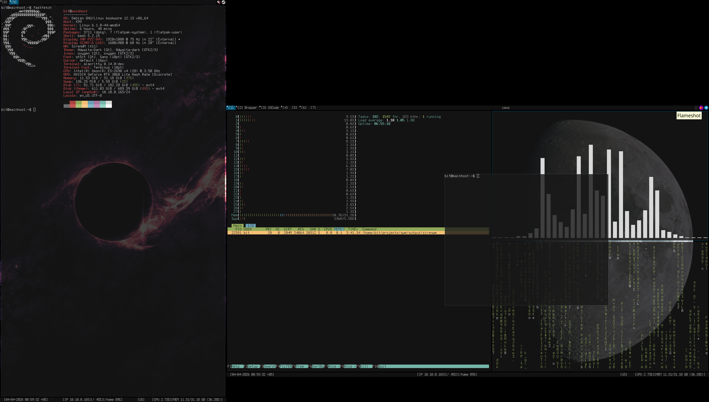

# SirenWM

SirenWM is a tiling window manager with selectable X11 and Wayland backends.



## About

SirenWM runs on X11 or Wayland, selected at build time. The C++ core handles layout, window management, and rendering. Everything else — keybindings, rules, autostart, wallpaper, widgets — is Lua, hot-reloaded without restarting. Failed reloads roll back automatically.

## Requirements

| Requirement | Minimum |
| ----------- | ------- |
| Display server | X11 (XCB, RandR) **or** Wayland (wlroots 0.17+) |
| C++ compiler | GCC 12 / Clang 16 (C++20) |
| CMake | 3.14 |
| Lua | 5.4 |

## Features

### Generic

#### Window management

- Tile and monocle layouts; custom layouts in Lua with full geometry control
- Master factor, gap, and border width adjustable at runtime
- Multi-monitor support with compose graph and workspace migration
- Per-monitor workspace pools with deterministic topology restore after restart
- Focus-follows-mouse and click-to-focus
- Floating windows with mod+drag move/resize
- Fullscreen and pseudo-fullscreen modes

#### Configuration

- Hot config reload (`mod+r`) and exec-restart (`mod+shift+r`) with Lua syntax pre-check
- Fallback to built-in default config when user config fails to parse
- `siren.load()` for optional modules — returns a null-object on failure so the config keeps working
- Window rules, process autostart, per-monitor wallpapers — all via Lua modules

#### Status bar

- Cairo/Pango bar at top and/or bottom of each monitor
- Lua widget API: write `render()`, set `interval`, drop into any bar zone
- Built-in widgets: workspace tags, focused window title
- Urgent workspaces highlighted in the tag strip

#### Developer

- ImGui debug overlay for live WM state inspection (`-DSIRENWM_DEBUG_UI=ON`, X11 only)
- Runtime lifecycle FSM (Idle → Configured → Starting → Running → Stopping → Stopped)
- Typed setting registry with transactional reload and per-setting validation

### X11 backend

- ICCCM: WM_DELETE_WINDOW, WM_TAKE_FOCUS, WM_HINTS (InputHint, UrgencyHint), WM_NORMAL_HINTS size constraints
- EWMH: `_NET_WM_STATE` fullscreen, `_NET_ACTIVE_WINDOW`, `_NET_CLOSE_WINDOW`, client list
- RandR hotplug — monitors added/removed at runtime without restart
- Pointer barriers confine cursor to active fullscreen monitor
- Fullscreen compatibility: MOTIF hints, Wine/Proton, SDL2, LibGDK
- System tray (XEmbed protocol)

### Wayland backend

- xdg-shell toplevels with map/unmap/fullscreen/maximize lifecycle
- wlr-layer-shell for bars and overlays (when available at build time)
- wlroots 0.17/0.18 support via compile-time API compatibility layer
- Runs nested under X11 or another Wayland compositor (useful for development)
- Direct KMS/DRM launch from TTY via libseat

## Architecture

```text
┌─────────────────────────────────────────────────────────────────┐
│                        User config                              │
│                  ~/.config/sirenwm/init.lua                     │
│        (loads modules, sets options, defines keybindings)       │
└───────────────────────────┬─────────────────────────────────────┘
                            │  require() / siren.load()
          ┌─────────────────┼──────────────────────┐
          │                 │                      │
          ▼                 ▼                      ▼
   ┌─────────────┐  ┌──────────────┐      ┌───────────────┐
   │ Lua modules │  │ C++ modules  │      │  Lua widgets  │
   │  rules      │  │  keybindings │      │  tags, title  │
   │  wallpaper  │  │  bar         │      │  clock, …     │
   │  autostart  │  │  keyboard    │      └───────┬───────┘
   └──────┬──────┘  │  sysinfo     │              │
          │         │  audio       │              │
          │         │  debug_ui    │              │
          │         └──────┬───────┘              │
          │                │                      │
          └────────────────▼──────────────────────┘
                           │  dispatch() / emit()
                           ▼
          ┌────────────────────────────────────────┐
          │                Runtime                 │
          │  lifecycle FSM · Lua host · hot-reload │
          │  setting registry · event bus          │
          └───────────────────┬────────────────────┘
                              │
                              ▼
          ┌────────────────────────────────────────┐
          │                 Core                   │
          │  window manager · layout engine        │
          │  workspace/monitor topology            │
          │  command dispatcher · event emitter    │
          └───────────────────┬────────────────────┘
                              │  port interfaces
                              ▼
          ┌────────────────────────────────────────┐
          │  MonitorPort · InputPort               │
          │  RenderPort  · KeyboardPort            │
          └───────────────────┬────────────────────┘
                              │  (selected at build time)
                    ┌─────────┴─────────┐
                    │                   │
                    ▼                   ▼
     ┌──────────────────────┐  ┌──────────────────────┐
     │     X11 backend      │  │   Wayland backend    │
     │  XCB · RandR · XKB   │  │  wlroots · xdg-shell │
     │  ICCCM · EWMH        │  │  layer-shell · DRM   │
     │  XEmbed tray         │  │  KMS via libseat     │
     └──────────────────────┘  └──────────────────────┘
```

The core never reads `init.lua` directly — it exposes a command/event API and the Lua layer drives it. C++ modules bridge the two: they register with the Lua host and translate Lua calls into core commands.

**Key design decisions:**

- **Port interfaces** (`MonitorPort`, `InputPort`, `RenderPort`, `KeyboardPort`) decouple the core from any display protocol. Swapping backends requires no core changes.
- **No global config object** — each module owns its settings via a typed registry. Hot-reload is transactional: snapshot → clear → re-execute `init.lua` → commit or rollback automatically.
- **Lua boundary is strict** — the core has no Lua dependency. Modules expose an API table; the user config is pure Lua on top.

## Getting Started

### 1. Dependencies

#### X11 backend — Debian / Ubuntu

```bash
sudo apt install \
  cmake pkg-config g++ \
  libx11-dev libx11-xcb-dev \
  libxcb1-dev libxcb-randr0-dev libxcb-keysyms1-dev \
  libxkbcommon-dev libxkbfile-dev libxfixes-dev liblua5.4-dev \
  libcairo2-dev libpango1.0-dev libfontconfig1-dev libfreetype-dev libpng-dev \
  libspdlog-dev
```

#### X11 backend — Fedora

```bash
sudo dnf install \
  cmake make pkgconf gcc-c++ \
  libX11-devel libxcb-devel xcb-util-keysyms-devel \
  libxkbcommon-devel libxkbfile-devel libXfixes-devel lua-devel \
  cairo-devel pango-devel fontconfig-devel freetype-devel libpng-devel \
  spdlog-devel
```

#### X11 backend — Arch Linux

```bash
sudo pacman -S \
  cmake make pkgconf gcc \
  libx11 libxcb xcb-util-keysyms \
  libxkbcommon libxkbfile libxfixes lua \
  cairo pango fontconfig freetype2 libpng \
  spdlog
```

#### Wayland backend — Debian (trixie+)

```bash
sudo apt install \
  cmake pkg-config gcc g++ \
  libwlroots-dev libwayland-dev libwayland-bin wayland-protocols \
  libxkbcommon-dev libpixman-1-dev libdrm-dev libgbm-dev libegl-dev \
  libinput-dev libudev-dev libseat-dev \
  libxcb1-dev libxcb-composite0-dev libxcb-xfixes0-dev libxcb-randr0-dev \
  libx11-dev libxfixes-dev \
  liblua5.4-dev libspdlog-dev \
  libcairo2-dev libpango1.0-dev libfontconfig1-dev libfreetype-dev libpng-dev
```

#### Wayland backend — Arch Linux

```bash
sudo pacman -S \
  cmake make pkgconf gcc \
  wlroots0.18 wayland wayland-protocols \
  libxkbcommon pixman libdrm mesa libinput seatd \
  libxcb xcb-util-keysyms xcb-util-wm libx11 libxfixes \
  lua spdlog cairo pango fontconfig freetype2 libpng
```

### 2. Build

```bash
# X11 backend (default)
cmake -S . -B build
cmake --build build -j$(nproc)

# Wayland backend
cmake -S . -B build -DSIRENWM_BACKEND=wayland
cmake --build build -j$(nproc)

# binaries:
#   output/sirenwm-x11
#   output/sirenwm-wayland
```

To build with the ImGui debug overlay (X11 only):

```bash
# extra dependencies — Debian/Ubuntu
sudo apt install libegl-dev libgl-dev
# extra dependencies — Fedora
sudo dnf install mesa-libEGL-devel mesa-libGL-devel
# extra dependencies — Arch Linux
sudo pacman -S mesa

cmake -S . -B build -DSIRENWM_DEBUG_UI=ON
cmake --build build -j$(nproc)
```

### 3. Config

A default config is written to `~/.config/sirenwm/init.lua` automatically on first run.
To start from the full annotated example instead:

```bash
mkdir -p ~/.config/sirenwm
cp init.lua.example ~/.config/sirenwm/init.lua
```

Edit `output = "HDMI-1"` to match your monitor name. On X11 use `xrandr`, on Wayland use `wlr-randr` to list outputs.

Minimal working config:

```lua
local kb  = require("keybindings")
local bar = require("bar")

siren.modifier = "mod4"   -- Super/Win key

siren.workspaces = { { name = "[1]" }, { name = "[2]" }, { name = "[3]" } }

siren.theme = { font = "monospace:size=9", bg = "#111111", fg = "#cccccc",
                accent = "#005577", gap = 4, border = { thickness = 1 } }

bar.settings = {
    top = { height = 18,
            left   = { siren.load("widgets.tags") },
            center = { siren.load("widgets.title") } }
}

kb.binds = {
    { "mod+Return",  function() siren.spawn("xterm") end },
    { "mod+shift+q", function() siren.win.close() end },
    { "mod+r",       function() siren.reload() end },
}
for i = 1, 9 do
    table.insert(kb.binds, { "mod+"..i, function() siren.ws.switch(i) end })
end
```

### 4. Run

**X11 — xinitrc** — add to `~/.xinitrc`:

```bash
exec /path/to/output/sirenwm-x11
```

**Wayland** — run directly from a TTY (wlroots opens DRM/KMS via libseat):

```bash
/path/to/output/sirenwm-wayland
```

**System install** (installs backend-specific binary and registers session entry):

```bash
sudo cmake --install build
```

Then select "SirenWM" from your display manager's session list.

## Default Keybindings

`mod` = Super/Win key (configurable via `siren.modifier`).

| Binding | Action |
| ------- | ------ |
| `mod+Return` | Launch `xterm` |
| `mod+shift+q` | Close focused window |
| `mod+j` / `mod+k` | Focus next / previous window |
| `mod+shift+Return` | Zoom focused window to master |
| `mod+shift+space` | Toggle floating |
| `mod+h` / `mod+l` | Shrink / grow master area |
| `mod+i` / `mod+d` | Increase / decrease master count |
| `mod+t` | Switch to tile layout |
| `mod+m` | Switch to monocle layout |
| `mod+1`…`mod+9` | Switch to workspace 1–9 |
| `mod+shift+1`…`mod+shift+9` | Move window to workspace 1–9 |
| `mod+ctrl+1`…`mod+ctrl+8` | Focus monitor 1–8 |
| `mod+ctrl+shift+1`…`mod+ctrl+shift+8` | Move window to monitor 1–8 |
| `mod+r` | Hot-reload config |
| `mod+shift+r` | Exec-restart (preserves windows) |
| `mod+Button1` | Drag-move floating window |
| `mod+Button3` | Drag-resize floating window |
| `mod+Button2` | Toggle floating |

## Documentation

- [`CONFIG.md`](CONFIG.md) — full Lua configuration reference
- [`init.lua.example`](init.lua.example) — annotated multi-monitor config

## License

GPL-2.0 — see [`LICENSE`](LICENSE).
